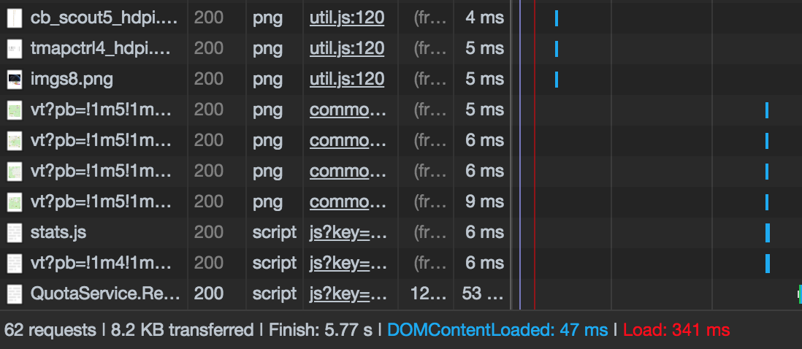
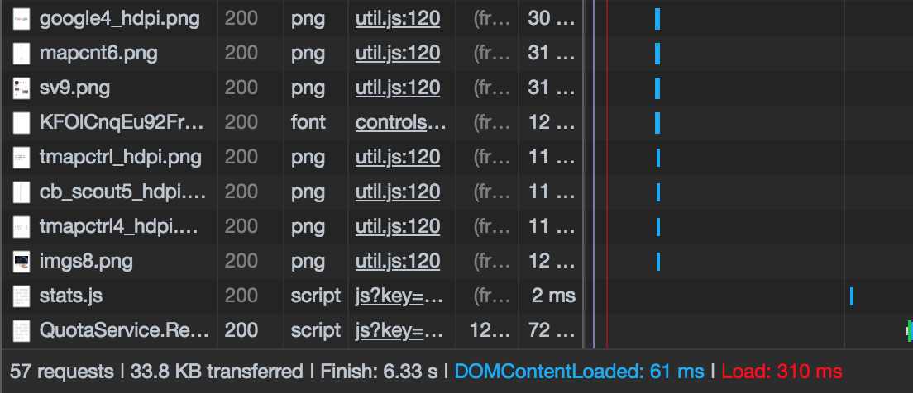

# Bugs

This is something that happens in every project and I thought to document the bugs I encountered and how I fixed these bugs may convey a way of thinking which you may be interested in.

## 1) User Location Marking Performance Bug

This problem occurred when first launching the application where the user is asked to "allow" use of their location to mark their location on the map and offer directions. Originally, everything went well and performance was as good as could be expected. However, it's only when I began testing the application on different devices and browser that I started noticed user location marking on the map was either very fast or very slow.

Due to the ambiguity of this bug, I tried started analysing the different situations in the following way:

Firstly, I began monitoring the network performance using the `network` tab in the browser inspector and gathered up results from running the application on Chrome. The yielded result showed that network process hanged when a request to the `QuotaService` is made. Below are screenshots of 2 tests on Chrome where getting the location and marking it on the map failed and succeeded.

**Successful Test**:

**Unsuccessful Test**:

The two screenshots above of the last network responses differ in a way which is consistent with all failing and successful test and that is the responses `vt?pb=!1m5!1m...` are present in the successful test and not in the failing tests. These responses contain render blocks for the map which I believe is used for building up the centred map.

First, I tried replacing the API key with a new one as I thought the key quota was exceeded or something went wrong with the key. That was unsuccessful so, I dug deeper and tried tweaking the API key restrictions and configurations to see if I forgot to set up something important but still nothing.

After searching through documentation and StackOverflow, I came to the conclusion that this was an issue caused by the location API and not the Google Maps API. The problem occurred due to no actionable user gesture was being required to request user location.

What I was doing is getting the location as soon as the page loaded but that is considered a security problem on live websites. However, I was able to test mine without any issues due to it being run from files e.g. `file:///` instead of `https://`. To pinpoint the bug and fix it, I simply hosted the website online on my website and added an extra button on the map for users to click and have their location fetched.
