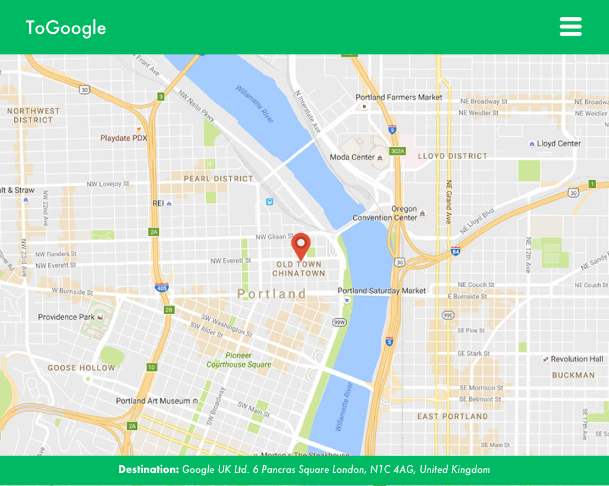
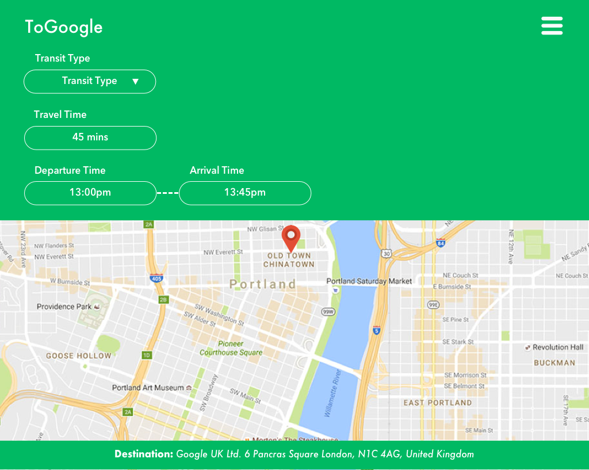
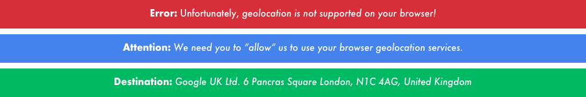
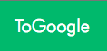
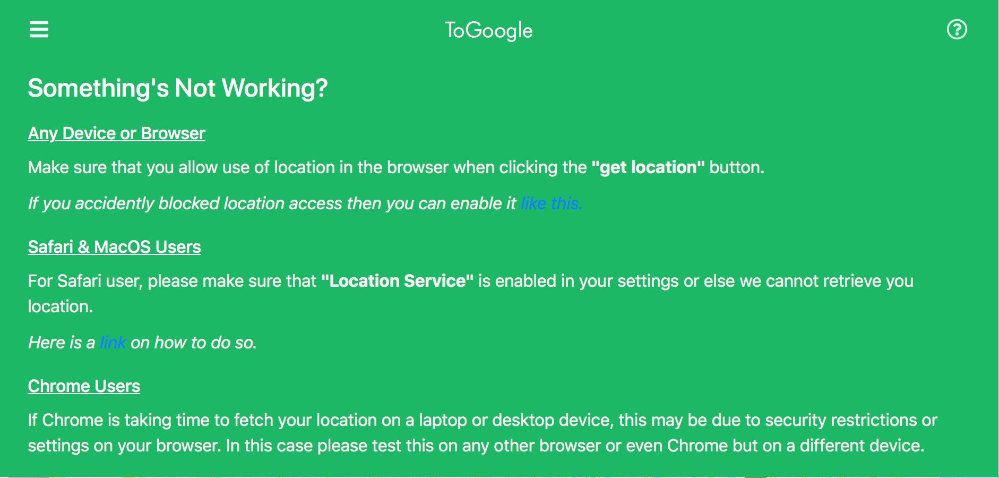
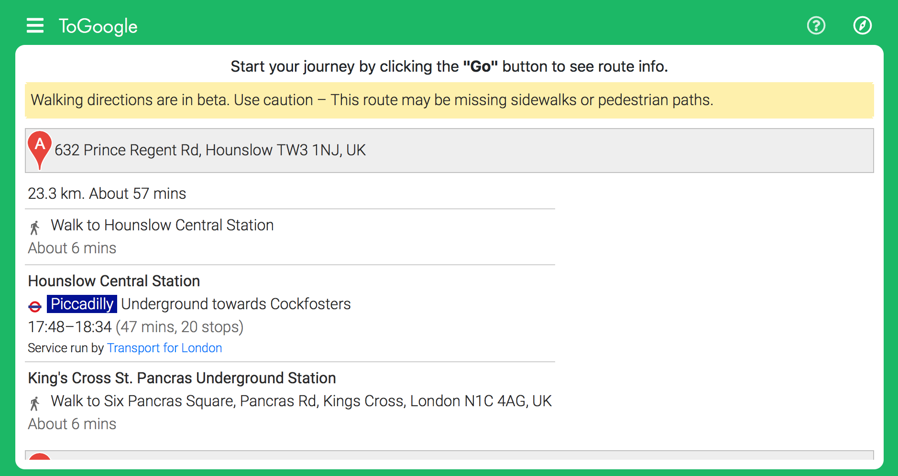

# Design Plan

For the design of this simple web app, I am going to implement a minimalistic material design that kind of meets `Google Design Guidelines`. The web app itself will be all in one view and will not link to any external HTML files. This makes things cleaner and smoother in terms animation and transitions.

During the design stage, I referenced to this Google colour scheme palette for my design to give what I like to call a `Googly` effect.

## Initial Prototype Design
I have designed a few high fidelity mockup prototypes of what I plan the web app to resemble upon completion. I accomplished this by using `Sketch` which is a lightweight graphics application.

### Main View

This view was mainly designed to be simplistic so that users can simply spot their destination and interact with the map in a hassle free manner without buttons and text being displayed everywhere distracting the user's from the main goal.

The map itself will have:
- A marker displaying where the final destination is. In this case, it's: `Google UK Ltd`.

- Another marker depicting the user's location on the map in real-time.

- Finally, a blue trail which shows the way to Google through the mode of transit chosen.

### Collapsed Menu View

This view will only appear once the menu (hamburger) icon (top left) is clicked. When clicked the bar will expand in a smooth animation and display the following properties, such as:

- **Transit Type** *(Editable through dropdown)*
- **Travel Time** *(Reliant on Transit Type)*
- **Departure** *(editable)* 
- **Arrival Time** *(Reliant on departure time)*

If the menu icon is clicked when the menu is open the menu will smooth back into how it looks like in the `Main view`.

### Footer

The footer is an addition I added to serve multiple useful purposes, such as:

- Shows alert & error messages like: 
    - *"Your broswer does not support geolocation"*
    - *"Getting user's location, please wait."*
    - *"Please allow for us to use your location."*
- Show's the destination address.

This is a good way for me to communicate any issues or notices to the user in a simplistic and non-intrusive manner. This solution replaced the original plan which was to use modal popups, but after some research I came to the realisation that people find them really annoying.

## Changes & Improvements

### Google Font

 A problem with the design initially was the font of the title `ToGoogle`. The font didn't have a Googly feel to it, so to resolve this I downloaded the Futura font that Google uses and applied it to the title. This led to the UI feeling more Googly and followed the material design guide better. Above shows the before (left) and after (after) looks of the web app name.

---

### Go & Update Button

An issue arose from automatically initialising the map, services and user location at the same time that led to the creation of the "Go" button (shown above). This was done because getting the users location takes the browser an average of around 3 - 4 seconds and initialising the map and its services which rely on the user's location happened in a matter of milliseconds. As a result of this, the user's location was passed in as `undefined` to the maps services requests and that led to errors because `undefined` is not a valid user location.

The resulting button fixed this as it makes user's wait till the location is found before they can begin their journey. The button itself is not visible until the location is found.

Once the user clicks **"Go"** the directions will be drawn on the map based on the journey settings and the button label will change to **"Update"** to convey that they can change their journey details such as transit mode and departure time, then click **"Update"** to change the travel time, travel distance and directions rendered on the map.

---

### Get Location Button

The reason for the addition of this button was in order to fix a bug regarding fetching the users location. The error originated from the lack of actionable user gesture like clicking a button to request permission to use their browsers geolocation API. This had to be done as it is a security measure imposed by browsers to prevent the automatic use of a users browser location API without their consent or knowledge.

---

### Collapsable Helper Menu & Navbar Redesign

Due to the different state and security implemntations preventing user location from being used on some devices or browsers there is potential for a wide variety of bugs and errors that can occur. Therefore, I have put together a helper menu as a guide to help users resolve any issues they might have that is not within the scope of the application. An example of this would be someone not having `Location Service` enabled on their mac.

---

### Collapsable Routing Menu

While surfing the Google Maps API documentation, I found the feature I had been looking for and that was the routing instruction panel. To accommodate for this crucial feature, I reorganised the navbar and added a new routing icon which triggers another collapsable menu with routing info. This addition has not affected responsiveness and only minor javascript and styling changes had to be made.