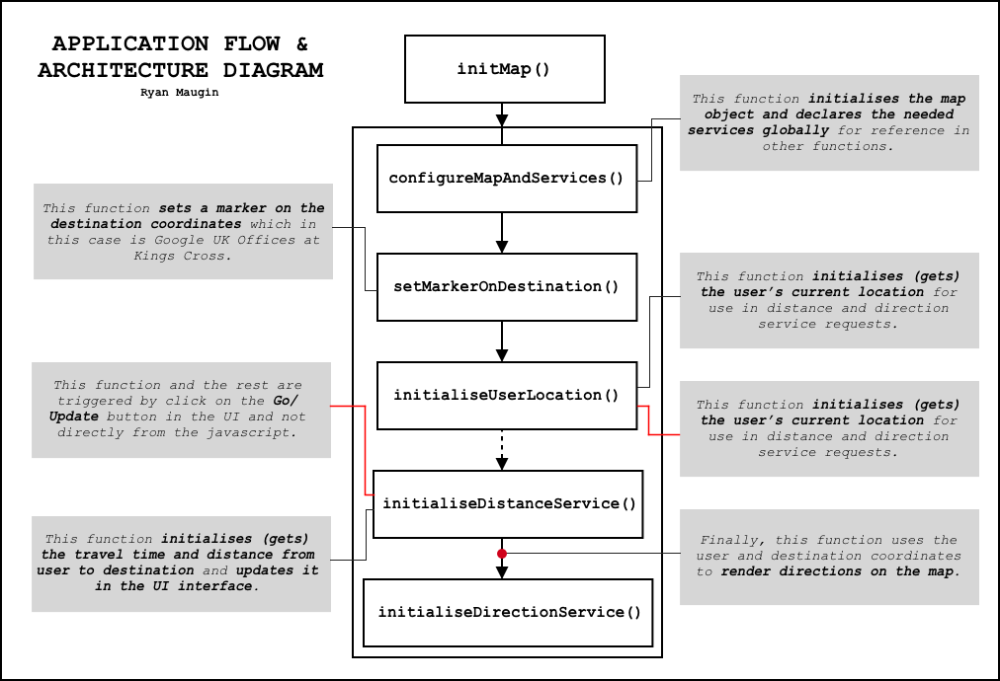

# Development Plan

> The development plan highlights everything in terms of technical development of the `ToGoogle` project.

## Dependencies

These are the few libraries my project depends on to aid the development of tasks that may otherwise be too consuming and tedious to do. Therefore, instead of reinventing the wheel I am maximising my efforts elsewhere such as scripting and streamlining tedious tasks with these dependencies:

-  **Bootstrap 4** - Cross-platform Responsivess.
- **Font Awesome** - Lightweight Icons.
- **JQuery** - Needed as dependency for Bootstrap.

## Project Structure

I have chosen this particular project structure (shown below) because it has a clear and intuitive layout that enables anyone old or new to the project to know exactly where everything is. I find that this helps keep things manageable and streamlined as the project scales up over time. This project structure is also very common amongst web development projects which allows for debugging to be easier as a lot of people can imagine your project structure and help you resolve some issues.

- **src** - Contains all development related files.
- **src/assets** - Holds Images and fonts.
- **src/css** - Contains Styling for HTML files.
- **src/js** - Contains Scripts for map and logic.
- **documentation** - Holds all the planning paperwork.
- **documentation/assets** - Holds images for documentation.

## Project Architecture/Flow

The architecture diagram below shows the sequential flow of code in the application. This is useful for keeping track of the order which functions are being executed in. In particular, it allows for people viewing the diagram to build up a mental image of how the code is executed and what each function depends on.

## User Interface Development

1. Add Top Bar with `ToGoogle` name on it and dropdown icon.
2. Create Footer with a destination address in it.
3. Add Google's Map in the centre.
4. Create dropdown menu forms for changing transit and modifying departure times.
5. Create Collapsable Helper Menu
6. Create `Go`, `Update` & `Get Location` Buttons.

## Google Maps API

1. Add basic map with a marker on the Google UK Offices.
2. Get User's location and mark it on the map.
3. Get User's Location Time & Set default departure time 30 minutes from current time.
4. Setup Directions from User's location to Google's offices.
5. Allow for Deperature time to be edited and arrival time to be recalculated.
6. Allow for user to choose different types of transit methods.
7. Get data and historical data about destination, stations and towns you travel to. 

## References

[Google Maps API - Introduction](https://developers.google.com/maps/documentation/javascript/tutorial)
- *For getting the basic map and marker setup.*

[W3Schools - HTML5 Geolocation](https://www.w3schools.com/html/html5_geolocation.asp)

- *For getting users realtime location.*

[Google Maps API - Markers](https://developers.google.com/maps/documentation/javascript/markers)

- *For understanding how normal markers work.*

[Google Maps API - Custom Markers](https://developers.google.com/maps/documentation/javascript/custom-markers)

- *For adding customised markers because it's cool & fun.*

[Google Maps API - Directions Service](https://developers.google.com/maps/documentation/javascript/directions)

- *Getting the directions from users location to Google UK.*